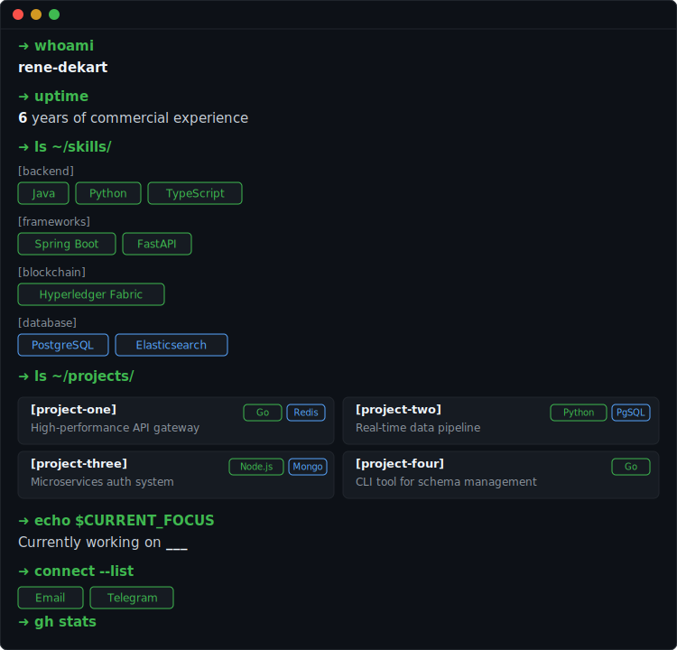

---

<table>
<tr>
<td width="50%">
<strong>📁 <a href="https://github.com/rene-dekart/[project-one]">[project-one]</a></strong> 
High-performance API gateway built with Go and Redis 
 
</td>
<td width="50%">
<strong>📁 <a href="https://github.com/rene-dekart/[project-two]">[project-two]</a></strong> 
Real-time data pipeline with Python and PostgreSQL 
 
</td>
</tr>
<tr>
<td width="50%">
<strong>📁 <a href="https://github.com/rene-dekart/[project-three]">[project-three]</a></strong> 
Microservices auth system with Node.js and MongoDB 
 
</td>
<td width="50%">
<strong>📁 <a href="https://github.com/rene-dekart/[project-four]">[project-four]</a></strong> 
CLI tool for database migrations and schema management 
 
</td>
</tr>
</table>

---

🎯 Currently working on **[your current project]**

---

  
  

  

  

---

